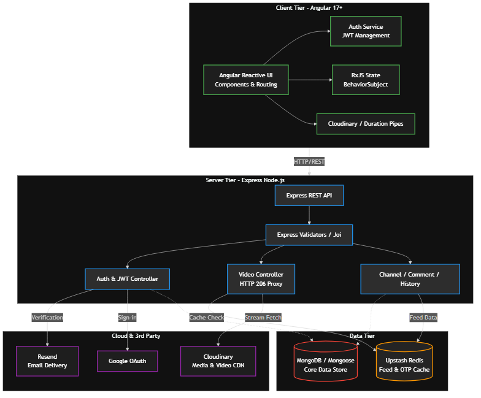

# YouCube — Video Streaming Platform



YouCube is a modern, high-performance video streaming platform replicating core functionalities of major video providers. Built on the **MEAN stack** (MongoDB, Express.js, Angular, Node.js) with aggressive **Redis** caching and **Cloudinary** CDN integration.

## 🚀 Key Features

*   **World-Class Video Streaming**: Chunked HTTP 206 `Partial Content` proxy streaming ensures instant playback and scrubbing without downloading entire media files or leaking origin CDN buckets.
*   **Real-Time Reactive UI**: Angular RxJS `BehaviorSubject` streams maintain global application state. Profile updates (avatars/usernames) are pushed to the DOM instantaneously without page reloads.
*   **High-Performance Caching**: Redis (via Upstash) sits in front of the MongoDB cluster. It caches heavy feed queries, stream URLs, and OTP verification sessions, collapsing server latency.
*   **Robust Security**: End-to-end security architecture utilizing `HttpOnly` refresh cookies, short-lived stateless JWT access tokens, OTP-based email verification, and Google OAuth 2.0.
*   **Premium Design System**: Fully responsive UI built with Bootstrap utility grids and a strictly managed CSS variable token layer enforcing unified Light and Dark modes.

---

## 🏗️ Architecture & Documentation

To understand the core architectures underpinning this repository, read the engineering documents:
- [Frontend Architecture](docs/frontend.md): Details the RxJS state management, routing, and theme engine.
- [Backend Architecture](docs/backend.md): Details the Node.js chunked streaming proxy, Redis integrations, and JWT authentication flows.
- [Testing Architecture](docs/testing.md): Explains the integration and unit test setups for both clients and servers.

---

## ⚙️ Prerequisites & Setup

Ensure the following environments are provisioned before attempting to run the system:
- **Node.js** (v18.x or higher)
- **MongoDB** cluster (local or Atlas)
- **Redis** instance (local or Upstash)
- **Cloudinary** account
- **Resend** account for transactional emails

### Environment Variables (.env)
You must create a `.env` file in the `/server` directory with the following keys:

```env
# Application Port
PORT=3000
NODE_ENV=development

# Core Connections
MONGO_URI=mongodb+srv://...
REDIS_URL=redis://...

# Security & JWT Secrets
JWT_SECRET=super_secret_key_access
JWT_REFRESH_SECRET=super_secret_key_refresh
GOOGLE_CLIENT_ID=your-google-client-id.apps.googleusercontent.com

# Integrations
RESEND_API_KEY=re_...
FROM_EMAIL=onboarding@resend.dev

# CDN
CLOUDINARY_CLOUD_NAME=name
CLOUDINARY_API_KEY=123
CLOUDINARY_API_SECRET=secret
```

---

## 🛠️ Local Installation Workflow

1. **Clone and Install Dependencies**
```bash
# Clone the repository
git clone https://github.com/MuhammadAbdelkader/youtube-clone.git
cd youtube-clone

# Install backend dependencies
cd server
npm install

# Install frontend dependencies
cd ../client
npm install
```

2. **Run the Development Servers**

We recommend running the backend and frontend in separate terminal windows.

**Start the Node.js Server:**
```bash
cd server
npm run dev
```

**Start the Angular Client:**
```bash
cd client
npm run start
# Navigate to http://localhost:4200
```

---

## 🧪 Testing

The repository relies on automated testing pipelines to prevent regressions. 

**Backend Test Suite:**
```bash
cd server
npm run test
```

**Frontend Test Suite:**
```bash
cd client
npm run test
```

## 📜 License
This project is licensed under the MIT License.
